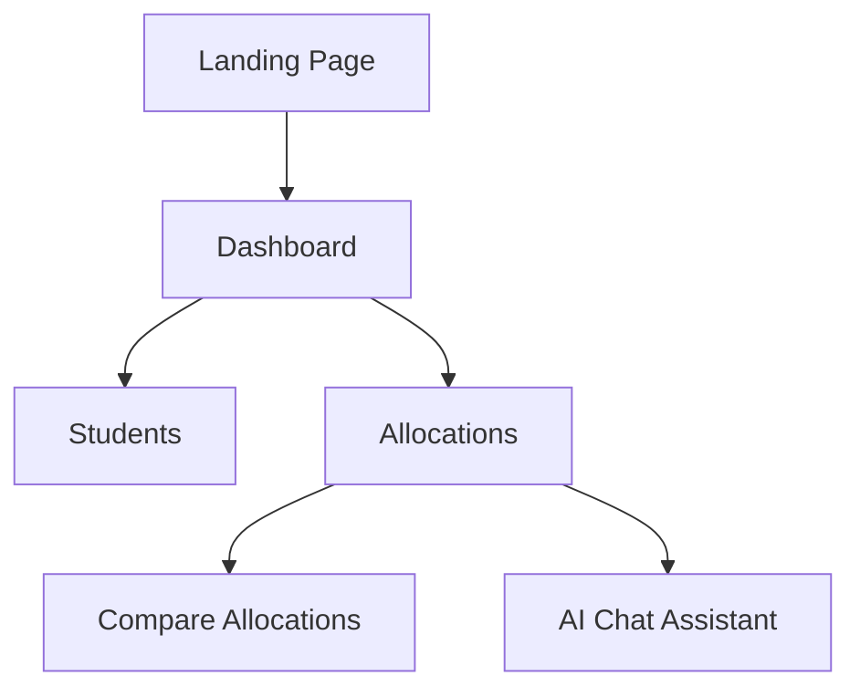

# ClassForge

ClassForge is a full-stack platform for intelligent class allocation, student network analysis, and interactive educational management. It leverages advanced algorithms, graph databases, and modern UI/UX to help educators and administrators optimize class assignments and visualize student relationships.

---

## Features

- **Smart Class Allocation:**  
  Use AI-driven algorithms to allocate students to classes based on customizable criteria.
- **Student Network Visualization:**  
  Visualize student relationships and class networks using interactive graph tools.
- **Data Import/Export:**  
  Easily import student data and export allocation results.
- **AI Chat Assistant:**  
  Integrated AI chat for allocation guidance and support.
- **Comparison Tools:**  
  Compare different allocation strategies and outcomes.
- **Admin Dashboard:**  
  Manage students, allocations, and view analytics from a unified dashboard.
- **Real-time Collaboration:**  
  Backend powered by NextJS, FastAPI, Redis, and Neo4j for scalable, real-time operations.

---

## Tech Stack


- **Frontend:** Next.js (TypeScript, React 19, TailwindCSS, Radix UI, Zustand, Recharts, Sigma.js)
- **Backend:** FastAPI, Python, Neo4j, Redis, RQ, LangChain, Uvicorn
- **Database:** Neo4j (Graph DB), Redis (Queue)
- **Containerization:** Docker, Docker Compose

---

## Project Structure

```
classforge/
│
├── backend/         # FastAPI backend, algorithms, models, services
├── frontend/        # Next.js frontend (TypeScript, React)
├── neo4j/           # Neo4j database data, config, plugins
├── redis-data/      # Redis data volume
├── docker-compose.yml
└── README.md
```

---

## Setup & Running Locally

### Prerequisites

- Docker & Docker Compose
- Node.js (for local frontend dev, optional)
- Python 3.10+ (for local backend dev, optional)

### Quick Start (Recommended)

```bash
# In the project root
docker compose up --build
```

- Frontend: http://localhost:3000
- Backend API: http://localhost:8000
- Neo4j Browser: http://localhost:7474 (user: neo4j, pass: password)
- Redis: localhost:6379

### Manual Development

#### Backend

```bash
cd backend
python -m venv venv
source venv/bin/activate
pip install -r requirements.txt
uvicorn main:app --reload
```

#### Frontend

```bash
cd frontend
npm install
npm run dev
```

---

## Sitemap




---

## API

- The backend exposes a FastAPI server at `/api`.
- OpenAPI/Swagger docs available at: `http://localhost:8000/docs`

---

## Environment Variables

- See `docker-compose.yml` for all environment variables.
- Backend expects:
  - `NEO4J_URI`, `NEO4J_USERNAME`, `NEO4J_PASSWORD`
  - `REDIS_HOST`

---

## Development Notes

- **Frontend:**
  - Uses strict TypeScript.
  - Main app in `frontend/app/`.
  - Custom hooks and components in `frontend/hooks/` and `frontend/components/`.
- **Backend:**
  - Main entry: `backend/main.py`
  - Algorithms: `backend/algofunction.py`, `backend/algorithm/`
  - Routers: `backend/routers/`
  - Services: `backend/services/`
  - Worker for background jobs: `backend/worker.py`

---

## Contributing

1. Fork the repo
2. Create your feature branch (`git checkout -b feature/YourFeature`)
3. Commit your changes
4. Push to the branch
5. Open a Pull Request

---

## Acknowledgements

- [Next.js](https://nextjs.org/)
- [FastAPI](https://fastapi.tiangolo.com/)
- [Neo4j](https://neo4j.com/)
- [Redis](https://redis.io/)
- [LangChain](https://python.langchain.com/)

---
